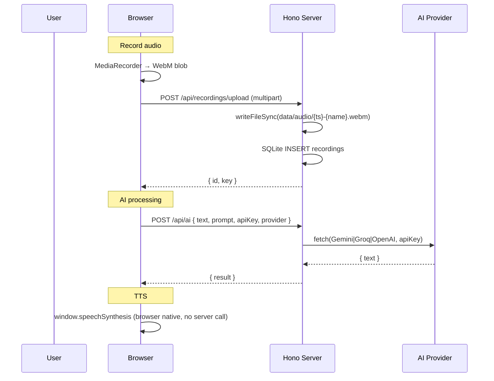

# PandaVoice — System Overview

> Audio recording, AI text processing, and TTS web app. Deployed as a self-hosted Node.js server behind nginx with HTTP Basic Auth.

**Stack:** React 19 · TypeScript 5.8 · Tailwind CSS · Zustand · Hono · Node.js · SQLite (better-sqlite3) · Vite 7

---

## Architecture

```
┌──────────────────────────────────────┐
│           Browser (Client)            │
│                                       │
│  React SPA (RTL Hebrew, dark mode)   │
│  ┌─────────┬──────────┬────────────┐ │
│  │ Editor  │ Toolbar  │  Modals    │ │
│  │ (record)│ AI/Trans │ (Settings) │ │
│  └────┬────┴─────┬────┴────────────┘ │
│       │          │                   │
│  Zustand store (localStorage persist) │
└───────┼──────────┼───────────────────┘
        │ HTTP     │ HTTP
        ▼          ▼
┌──────────────────────────────────────┐
│     nginx (pandavoice.panda-il.com)  │
│     HTTP Basic Auth + SSL            │
└───────────────┬──────────────────────┘
                │ proxy_pass :3000
                ▼
┌──────────────────────────────────────┐
│       Hono Node.js Server            │
│                                      │
│  POST /api/ai          → AI proxy    │
│  POST /api/translate   → AI proxy    │
│  *    /api/recordings  → SQLite+FS   │
│  GET  /api/users/me    → static user │
│  /*                    → React SPA   │
└───────────────┬──────────────────────┘
                │
        ┌───────┴───────┐
        ▼               ▼
   SQLite DB       data/audio/
 (pandavoice.db)   (*.webm files)
```

---

## Data Flow



---

## Directory Structure

```
code/
├── src/
│   ├── shared/
│   │   └── types.ts          # Zod schemas (AIRequest, TranslateRequest)
│   ├── server/
│   │   ├── index.ts          # Hono app, static serving, DB init
│   │   ├── db.ts             # SQLite init + getDB()
│   │   └── routes/
│   │       ├── ai.ts         # POST /api/ai → Gemini/Groq/OpenAI
│   │       ├── translate.ts  # POST /api/translate
│   │       └── recordings.ts # CRUD /api/recordings/*
│   └── react-app/
│       ├── App.tsx           # Router + AuthProvider
│       ├── main.tsx          # React root
│       ├── store/
│       │   └── useAppStore.ts  # Zustand (config, content, apiKeys, TTS)
│       ├── hooks/
│       │   └── useAuth.tsx   # /api/users/me → user context
│       ├── pages/
│       │   ├── Home.tsx      # Main page (modal orchestration)
│       │   └── AuthCallback.tsx  # Dead — OAuth never configured
│       └── components/
│           ├── Editor.tsx    # MediaRecorder + text editor
│           ├── Header.tsx    # Brand, dark mode, logout
│           ├── Footer.tsx    # Copy, download, share actions
│           ├── Toolbar.tsx   # AI / Translate / TTS triggers
│           ├── RecordingsModal.tsx  # List/play/delete recordings
│           ├── InstallPrompt.tsx    # PWA install prompt
│           ├── ErrorBoundary.tsx
│           └── modals/       # Modal, AIModal, TranslateModal, TTSModal,
│               ...           #  SettingsModal, HelpModal, AdminModal, etc.
├── build-server.mjs          # esbuild config (bundles server → dist/server/)
├── vite.config.ts            # Vite (bundles client → dist/)
├── ecosystem.config.cjs      # PM2 config
└── dist/
    ├── index.html            # Built React app
    ├── assets/               # Vite-built JS/CSS chunks
    └── server/
        └── index.js          # esbuild-bundled server
```

---

## External Dependencies

| Package | Version | Purpose |
|---------|---------|---------|
| `hono` | 4.7.7 | HTTP framework (Node.js) |
| `@hono/node-server` | ^1.19.14 | Node adapter + serveStatic |
| `better-sqlite3` | ^11.9.1 | SQLite (sync API) |
| `react` | 19.0.0 | UI framework |
| `react-router` | ^7.5.3 | SPA routing |
| `zustand` | ^5.0.10 | State management (localStorage persist) |
| `zod` | ^3.24.3 | Input validation |
| `react-hot-toast` | ^2.6.0 | Toast notifications |
| `lucide-react` | ^0.510.0 | Icon library |

**Build tooling:** Vite 7 (client) + esbuild (server) + TypeScript 5.8

**Runtime:** Node.js 22+ · PM2 · nginx · Ubuntu VPS

---

## Auth Design

Authentication is handled at the nginx layer via HTTP Basic Auth.

- nginx prompts for `user:password` before any request reaches Node.js
- The server's `/api/users/me` returns a static `{ id: 'local', name: 'Admin' }` object
- The React `useAuth` hook uses this to bypass the login modal
- There is NO per-user session management

This is intentional — PandaVoice is a single-user / single-tenant tool.

---

## State Persistence

All app state (config, apiKeys, ttsSettings, content, darkMode) persists to `localStorage['pandavoice-storage']` via Zustand's `persist` middleware. The server stores nothing about the user's configuration — only audio recordings in SQLite/filesystem.

**Implication:** API keys exist only in the browser. They ARE sent to the server in request bodies on every AI/translate call, contradicting the privacy policy (which states keys never leave the browser). See ActionPlan.md.

---

## Known Issues & Weaknesses

| Severity | Issue |
|----------|-------|
| **High** | Privacy policy claims API keys stay in browser — they're sent to server in request body |
| **High** | No rate limiting on `/api/ai` and `/api/translate` — any authed user can spam external APIs |
| **Medium** | No upload file size limit — large audio files could exhaust disk |
| **Medium** | No mime-type validation on recording upload — any file accepted |
| **Low** | Dead tables: `users` and `sessions` in SQLite (never written to) |
| **Low** | Dead state: `hf`, `claude`, `fbKey`, `fbProj` API keys in Zustand |
| **Low** | `AuthCallbackPage` and `login()` function are dead code (Google OAuth removed) |
| **Low** | Legal/privacy text still mentions Cloudflare R2 and Google OAuth |

---

## Development Status

| Area | Status |
|------|--------|
| Recording + upload | ✅ Complete |
| AI text processing | ✅ Complete |
| Translation | ✅ Complete |
| TTS (browser native) | ✅ Complete |
| Settings / brand config | ✅ Complete |
| Recordings list / playback | ✅ Complete |
| Auth (nginx basic) | ✅ Complete |
| Static file serving | ✅ Fixed (serveStatic added) |
| VPS deployment | 🔲 Pending |
| Rate limiting | ❌ Missing |
| File upload limits | ❌ Missing |
